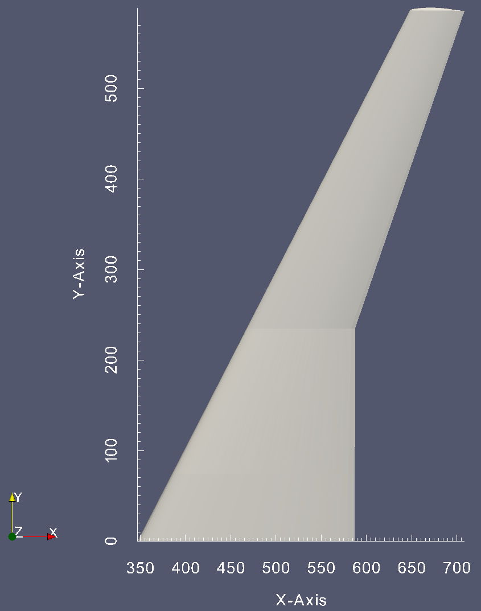

Disclaimer: This is a rough draft for `tutorial2.ipynb`.
If you're willing to take the tutorial check the jupyter notebook instead.

# pyPanair Tutorial#2 Tapered Wing  
In this tutorial we will perform an analysis of a tapered wing.  
The wing is defined by five different wing sections at $\eta=0.000, 0.126, 0.400, 0.700, 1.000$.  

Below are the wing planform and airfoil stack, respectively.
(The wing is based on the [DLR-F4<sup>1</sup>](https://aiaa-dpw.larc.nasa.gov/Workshop1/files/agard-ar-303.pdf))



```python
%matplotlib notebook
import matplotlib.pyplot as plt
from pyPanair.preprocess import wgs_creator
for eta in ("0000", "0126", "0400", "0700", "1000"):
    af = wgs_creator.read_airfoil("eta{}.csv".format(eta)) 
    plt.plot(af[:,0], af[:,2], "k-", lw=1.)
plt.plot((504.9,), (0,), "ro", label="Center of Gravity")
plt.legend()
plt.show()
```

## 1.Defining the geometry
Just as we have done in tutorial 1, we will use the `wgs_creator` module to define the geometry of the wing.

First off, we initialize a `LaWGS` object.

```python
wgs = wgs_creator.LaWGS("tapered_wing")
```

Next, we create a `Line` object that defines the coordinates of the airfoil at the root ($\ata=0.000$) of the wing.  
To do so, we will read a csv file that contains the coordinates of the airfoil, using the `read_airfoil` function.  

Five csv files, `eta0000.csv`, `eta0126.csv`, `eta0400.csv`, `eta0700.csv`, and `eta1000.csv`, have been prepared for this tutorial.  

Before creating the `Line` object, we will take a quick view at these files.  
For example, `eta0000.csv` looks like ...

```python
import pandas as pd
pd.set_option("display.max_rows", 10)
pd.read_csv("eta0000.csv")
```

The first and second columns `xup` and `zup` represent the x & z coordinates of the upper surface of the airfoil.  
The third and fourth columns `xlow` and `zlow` represent the x & z coordinates of the lower surface of the airfoil.  

The csv file must follow four rules:  
1. Data in the first row correspond to the x & z coordinates of the leading edge of the airfoil  
2. Data in the last row correspond to the x & z coordinates of the trailing edge of the airfoil  
3. For the first row, the coordinates `(xup, zup)` and `(xlow, zlow)` are the same  
4. For the last row, the coordinates `(xup, zup)` and `(xlow, zlow)` are the same (i.e. the airfoil has a sharp TE)  

Now we shall create the `Line` object for the root of the wing.

```python
wingsection1 = wgs_creator.read_airfoil("eta0000.csv", span_pos=0.)
```

The first variable specifies the name of the csv file.  
The `span_pos` variable defines the spanwise position (i.e. the y-axis coordinate) of the `Line`.

In the same way we created the `Line` object for the root of the wing, we will create `Line` objects for the remaining four wing sections.

```python
wingsection2 = wgs_creator.read_airfoil("eta0126.csv", span_pos=74.2108)
wingsection3 = wgs_creator.read_airfoil("eta0400.csv", span_pos=235.051)
wingsection4 = wgs_creator.read_airfoil("eta0700.csv", span_pos=410.350)
wingsection5 = wgs_creator.read_airfoil("eta1000.csv", span_pos=585.650)
```

Next, we create four networks by linearly interpolating these wing sections.

```python
wingnet1 = wingsection1.linspace(wingsection2, num=4)
wingnet2 = wingsection2.linspace(wingsection3, num=8)
wingnet3 = wingsection3.linspace(wingsection4, num=9)
wingnet4 = wingsection4.linspace(wingsection5, num=9)
```

Then, we concatenate the networks using the `concat_row` method.

```python
wing = wingnet1.concat_row((wingnet2, wingnet3, wingnet4))
```

The concatenated network is displayed below.

```python
wing.plot_wireframe()
```

After creating the `Network` for the wing, we create networks for the wingtip and wake.

```python
wingtip_up, wingtip_low = wingsection5.split_half()
wingtip_low = wingtip_low.flip()
wingtip = wingtip_up.linspace(wingtip_low, num=5)

wake_length = 50 * 141.2
wingwake = wing.make_wake(edge_number=3, wake_length=wake_length)
```

Next, the `Networks` will be registered to the `wgs` object.

```python
wgs.append_network("wing", wing, 1)
wgs.append_network("wingtip", wingtip, 1)
wgs.append_network("wingwake", wingwake, 18)
```

Then, we create a stl file to check that there are no errors in the model.  

```python
wgs.create_stl("tapered_wing.stl")
```

Last, we create input files for `panin`

```python
wgs.create_aux("tapered_wing.aux", alpha=(-2, 0, 2), mach=0.6, cbar=0.1412, span=1.1714,
              sref=0.1454, xref=0.5049, zref=0.)
wgs.create_wgs("tapered_wing.wgs")
```

## 2. Analysis

The analysis can be done in the same way as tutorial 1.  
Place `panair`, `panin`, `tapered_wing.aux`, and `tapered_wing.wgs` in the same directory, 
and run `panin` and `panair`.

```bash
$ ./panin
 Prepare input for PanAir
  Version 1.0 (4Jan2000)
 Ralph L. Carmichael, Public Domain Aeronautical Software
 Enter the name of the auxiliary file: 
tapered_wing.aux
          10  records copied from auxiliary file.
           9  records in the internal data file.
  Geometry data to be read from tapered_wing.wgs                                                                
 Reading WGS file...
 Reading network wing
 Reading network wingtip
 Reading network wingwake
 Reading input file instructions...
 Command  1 MACH 0.6
 Command 11 ALPHA -2 0 2
 Command  6 cbar 0.1412
 Command  7 span 1.1714
 Command  2 sref 0.1454
 Command  3 xref 0.5049
 Command  5 zref 0.0
 Command 35 BOUN 1 1 18
 Writing PanAir input file...
  Files a502.in added to your directory.
 Also, file panin.dbg
 Normal termination of panin, version 1.0 (4Jan2000)
 Normal termination of panin
```

```bash
$ ./panair
 Panair High Order Panel Code, Version 15.0 (10 December 2009)
 Enter name of input file:
a502.in
```

After the analysis finishes, place `panair.out`, `agps`, and `ffmf` in the `tutorial2` directory.

## 3. Visualization

Visualization of the results can be done in the same manner as tutorial 2.

```python
from pyPanair.postprocess import write_vtk
write_vtk(n_wake=1)

from pyPanair.postprocess import calc_section_force
calc_section_force(aoa=2, mac=0.1412, rot_center=(0.5049,0,0), casenum=3, networknum=1)

section_force = pd.read_csv("section_force.csv")
section_force

plt.plot(section_force.pos / 0.5857, section_force.cl, "s", mfc="None", mec="b")
plt.xlabel("spanwise position [normalized]")
plt.ylabel("local lift coefficient")
plt.grid()
plt.show()
```

The `ffmf` file can be parsed using the `read_ffmf` and `write_ffmf` methods.

```python
from pyPanair.postprocess import write_ffmf, read_ffmf
read_ffmf()
write_ffmf()
```

The `read_ffmf` method parses the `ffmf` file and converts it to a `pandas` `DataFrame`.  
The `write_ffmf` will convert the `ffmf` file to a csv file. (The default name of the converted file is `ffmf.csv`)

### Reference
1. Redeker, G., "A selection of experimental test cases for the validation of CFD codes,"
 *AGARD AR-303*, 1994.